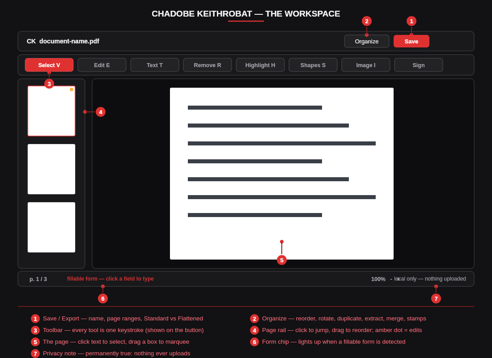
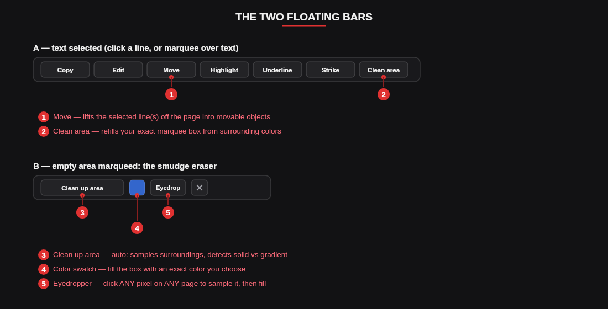
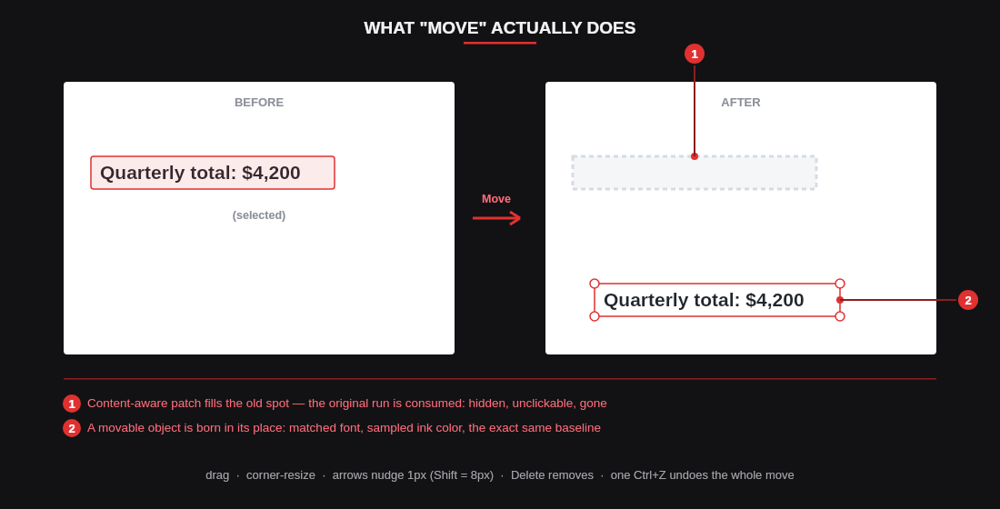
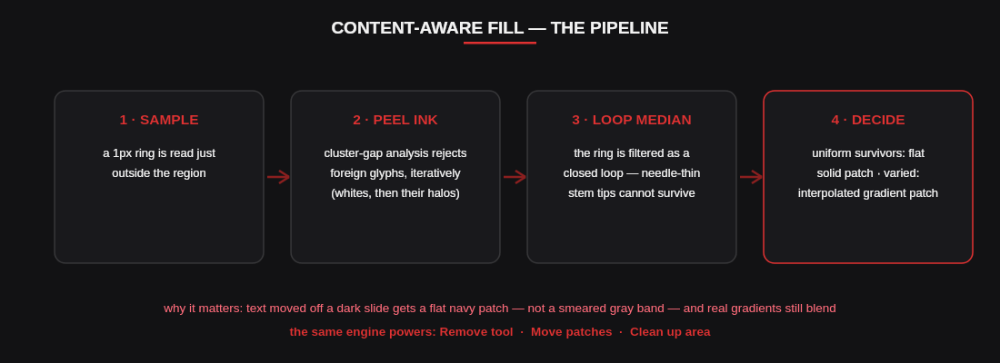
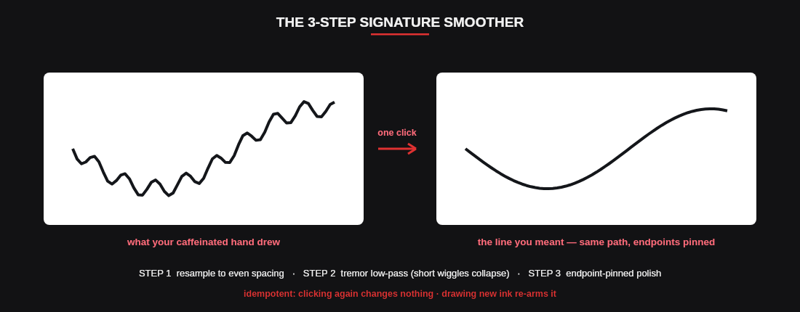
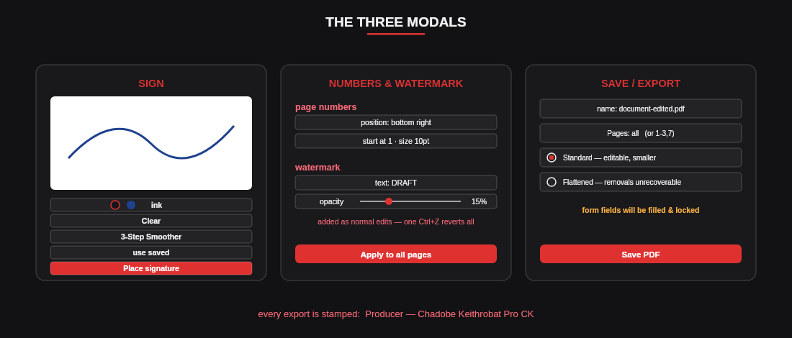

# Chadobe **Keithrobat**
### A free, browser-based **.PDF** editor

*from the **Chadobee Creative!** (Sweet!) ❤*

`no account` · `no upload — files never leave this device` · `free, all features`

**[▶ Use it live](https://chchchadzilla.github.io/ChadobeKeithrobat/)** · **[⭐ GitHub](https://github.com/chchchadzilla/ChadobeKeithrobat)** · **[❤ Donate — the "help chad take his family on a vacation for once" fund](https://buy.stripe.com/fZu8wR3YDde8aKk5cf2sM04)**

---

**Chadobe Keithrobat** is a complete PDF editor in one HTML file. Open it in a browser, drop a PDF on it, and edit — text, images, forms, signatures, shapes, pages — then save. Nothing is ever uploaded anywhere: every byte of your document stays on your machine, processed entirely by your own browser.

> **The whole app is one file:** `index.html`. Host it anywhere (or double-click it locally). Visitors need internet access only for three open-source libraries fetched from CDNs (rendering, writing, and font embedding).

---

## 📖 Table of Contents

1. [Quick Start](#1-quick-start)
2. [The Workspace](#2-the-workspace)
3. [The Toolbar & Keyboard Shortcuts](#3-the-toolbar--keyboard-shortcuts)
4. [Selecting Things](#4-selecting-things)
5. [Editing Text (Font Matching)](#5-editing-text-font-matching)
6. [Your Own Fonts — PC Fonts & TTF Loading](#6-your-own-fonts--pc-fonts--ttf-loading)
7. [Moving Text & Objects](#7-moving-text--objects)
8. [Removing Content — Content-Aware Fill](#8-removing-content--content-aware-fill)
9. [✨ Clean Up Area — the Smudge Eraser](#9--clean-up-area--the-smudge-eraser)
10. [Images & Background Removal](#10-images--background-removal)
11. [Shapes & Freehand Drawing](#11-shapes--freehand-drawing)
12. [Highlight, Underline & Strikethrough](#12-highlight-underline--strikethrough)
13. [Fill & Sign — Forms](#13-fill--sign--forms)
14. [The Signature Pad & the 3-Step Signature Smoother](#14-the-signature-pad--the-3-step-signature-smoother)
15. [Page Numbers & Watermarks](#15-page-numbers--watermarks)
16. [Organize Pages](#16-organize-pages)
17. [Find & Copy Text](#17-find--copy-text)
18. [Saving & Exporting](#18-saving--exporting)
19. [Sessions, Crash Recovery & Privacy](#19-sessions-crash-recovery--privacy)
20. [Keyboard Reference Card](#20-keyboard-reference-card)
21. [Under the Hood](#21-under-the-hood)
22. [Honest Limitations](#22-honest-limitations)
23. [Troubleshooting & FAQ](#23-troubleshooting--faq)
24. [Credits](#24-credits)

---

## 1. Quick Start

1. **Open the app** at the live page, or double-click your own copy of `index.html`.
2. **Drop a PDF anywhere** on the splash screen — or click the paper sheet to browse. Editing starts instantly; there is no account, no upload, no waiting.
3. **Click things.** Click a line of text to select it. Drag a box to select a region. Every tool is one keystroke away (see [§3](#3-the-toolbar--keyboard-shortcuts)).
4. **Save** with the red button (or `Ctrl+S`). Your edited PDF downloads immediately.

You can also open additional PDFs mid-session — they merge in as extra pages ([§16](#16-organize-pages)).

---

## 2. The Workspace

| Region | What it does |
|---|---|
| **Top bar** | The CK mark, your file name, **Organize** (page management view), and the red **Save** button. |
| **Toolbar** | Every editing tool, each with a single-key shortcut shown on its button. |
| **Page rail** (left) | Live thumbnails of every page. Click to jump; an **amber dot** marks pages that carry edits. |
| **The page** | Where everything happens. Text is clickable, regions are marqueeable, objects are draggable. |
| **Status bar** | Current page indicator, zoom controls, the **form chip** (appears when a fillable form is detected), and the permanent reminder: *local only — nothing uploaded*. |

Pages are **virtualized** — only the ones on screen are rendered — so thousand-page documents scroll smoothly.

---

## 3. The Toolbar & Keyboard Shortcuts

| Tool | Key | What it does |
|---|---|---|
| **Select** (pointer) | `V` | Click text lines and objects, drag marquee boxes, move things. The default tool — most work happens here. |
| **Edit text** | `E` | Click any text to rewrite it in place with matched font, size, and color ([§5](#5-editing-text-font-matching)). |
| **Add text** | `T` | Click anywhere to type new text onto the page. |
| **Remove** | `R` | Click a text run, or drag over a region, to erase it with a content-aware patch ([§8](#8-removing-content--content-aware-fill)). |
| **Highlight** | `H` | Drag across text to highlight it. |
| **Shapes** | `S` | Rectangle, ellipse, line, arrow, freehand ink — with a live options popover ([§11](#11-shapes--freehand-drawing)). |
| **Image** | `I` | Insert a picture (PNG/JPG); drag, resize, rotate, remove its background ([§10](#10-images--background-removal)). |
| **Sign** | — | Opens the signature pad ([§14](#14-the-signature-pad--the-3-step-signature-smoother)). |

Full keyboard reference in [§20](#20-keyboard-reference-card).

---

## 4. Selecting Things

Selection is where Keithrobat does most of its thinking, so here's exactly how it decides:

### Click
- **Click a text line** → it selects, and the floating **selection bar** appears above it with actions (see below).
- **Click any object you've added** — text, image, shape, ink, signature — → it selects with corner handles, ready to drag or resize.
- **Shapes select from their outline.** An unfilled rectangle is clickable along its line (with a generous invisible hit zone), while its interior stays click-through so it never blocks the text inside it. *Filled* shapes select from anywhere on their body.

### Multi-select — `Ctrl+click` / `Shift+click` (⌘ on Mac)
Click one text line, then **Ctrl+click** others to add them to the selection. Clicking an already-selected line **toggles it off**. The selection bar repositions over the whole set, and **Move** lifts them all as a group ([§7](#7-moving-text--objects)).

### Marquee (drag a box)
The box is *intent-aware*, checked in priority order:

1. **Your own edits win.** If the box covers something you added (its center inside your box, or most of it covered), *that* gets selected — never the invisible original text underneath it.
2. **Original text** is selected only on *meaningful* overlap — grazing a line by a sliver doesn't hijack your box.
3. **Nothing at all?** You get the **area bar** — the smudge eraser ([§9](#9--clean-up-area--the-smudge-eraser)).

**Text selection bar actions:** `Copy` · `Edit` (single line) · `Move` · `Highlight` · `Underline` · `Strike` · `✨ Clean area` (marquee selections only — fills your exact box).

### One rule that keeps you sane
Text you have **moved or removed is *gone* from its old spot** — hidden, unclickable, invisible to marquees. It cannot be accidentally re-selected or duplicated. Undo brings it back completely.

---

## 5. Editing Text (Font Matching)

Press `E` (or use the selection bar's **Edit**), click any text, and rewrite it. Keithrobat's editor doesn't guess at styling — it *measures*:

- **Font matching.** The embedded font's real name is read (including subset tags like `ABCDEF+Garamond-SemiBold`) and mapped to the closest of the 14 standard PDF fonts, preserving **weight** (bold) and **slant** (italic). The inspector shows what matched and how confidently.
- **Ink & background color sampling.** The actual rendered pixels are sampled, so your replacement text arrives in the original's color, on a patch matching the original's background.
- **Exact baseline.** The replacement is drawn on the *same baseline* as the original — verified to under 2px of drift at 2× rendering — so a one-word edit never makes a line jump.
- **Fit-to-box.** Longer replacements auto-shrink to stay inside the original's footprint instead of reflowing your document.

Every text object stays editable afterward via the **inspector** panel (font, size, color, alignment) whenever it's selected.

---

## 6. Your Own Fonts — PC Fonts & TTF Loading

The built-in matcher maps to the closest of the 14 standard PDF fonts — good, but not *your* font. Keithrobat can now use **the real thing**:

### PC fonts (Chrome / Edge)
Open any text editor (Edit or Add Text) and hit **PC fonts**. Your browser asks permission once, then **every font installed on your computer** appears in the font menu under *Computer fonts* — listed instantly, loaded lazily (bytes are only read when you actually pick one).

### +TTF (every browser)
Hit **+TTF** and choose `.ttf` / `.otf` files — brand fonts, downloaded fonts, anything. They join the menu under *Your fonts*.

### Automatic rescue
When a document uses a font the built-ins can't confidently match, the editor **tells you** — an amber warning names the font and points at PC fonts / +TTF — instead of silently defaulting. And if your loaded fonts include a match for the document's font name (subset tags like `ABCDEF+MyriadPro-BoldIt` are parsed, weight and slant detected), Keithrobat **auto-selects your real font** and says so: *matched to YOUR font*.

### What export does
Text set in your fonts is embedded in the saved PDF as the **actual font file, subsetted** — only the glyphs you used, so files stay small and the text is pixel-perfect in every viewer, forever. Fonts used by your edits also persist in crash-recovery sessions.

Two honest notes: a font file carries its own weight/slant, so the B/I toggles disable for custom picks (they'd be lying); and PC-fonts enumeration is a Chromium API — Firefox/Safari users use +TTF, which works everywhere.

---

## 7. Moving Text & Objects

### Moving original page text
Three equivalent ways:

1. **Click a line, hit `Move`** in the selection bar.
2. **Click-drag the line directly** — a live ghost follows your cursor.
3. **Select it and press an arrow key** — the first press lifts it automatically, then nudges.

Whichever you use, the same thing happens under the hood: the old spot is refilled with a **content-aware patch**, the original run is **consumed** (gone — unclickable, unduplicatable), and the text is reborn as a movable object with its matched font, sampled ink color, and *exact original baseline*.

### Group moves
Multi-select lines with `Ctrl+click`, hit **Move**, and they lift as a **group**: drag any member and every member travels by the identical delta; arrow keys nudge them all; `Delete` removes them all. One `Ctrl+Z` reverses the entire operation.

### Nudging — the precision tool
With anything selected:

| Keys | Movement |
|---|---|
| `↑ ↓ ← →` | 1 pixel |
| `Shift + arrows` | 8 pixels |

Rapid taps coalesce into a **single undo step** — six taps right is one `Ctrl+Z`, not six.

### Z-order guarantee
Fill patches are **always background**. Drag text across a previously cleaned area and the text renders — and exports — *on top of* the patch, no matter which was created first.

---

## 8. Removing Content — Content-Aware Fill

Press `R`, then click a text run or drag over any region. The area is erased and refilled to match its surroundings — this is the engine behind Remove, Move's patches, and Clean Up Area alike.

How it stays clean, step by step:

1. **Sample** — a one-pixel ring is read just outside the region.
2. **Peel ink** — the ring's samples are cluster-analyzed: foreign ink (glyphs from a neighboring line crossing the ring) forms a distinct far cluster with a measurable *gap*, while a legitimate gradient is a smooth continuum with no gap. Foreign clusters are peeled **iteratively** — solid glyphs first, then their antialiased halos.
3. **Loop median** — the ring is filtered as the *closed loop it physically is*, so needle-thin artifacts (ascender/descender tips grazing the ring) cannot survive anywhere, including at edge boundaries. Uniform and gradient stretches pass through mathematically unchanged.
4. **Decide** — if the cleaned survivors are uniform, you get a **flat solid patch** matching the background exactly. If they genuinely vary, you get a **distance-weighted interpolated gradient patch** that blends invisibly.

**Practical upshot:** removing white text from a dark navy slide yields flat navy, not a smeared gray band — while removing text from a real gradient banner still blends perfectly.

> **Important:** in a **Standard** export, removed content is *covered*, not destroyed — recoverable by a determined party. For true redaction, use **Flattened** export ([§18](#18-saving--exporting)). The inspector reminds you of this.

---

## 9. ✨ Clean Up Area — the Smudge Eraser

Ever get a blemish, artifact, or leftover mark you just want *gone*? With the pointer tool, **drag a box over it** (slightly larger than the blemish, so the sampler sits on clean background). If the box catches nothing else, the **area bar** appears with three weapons:

| Button | What it does |
|---|---|
| **✨ Clean up area** | Content-aware refill from the surroundings — automatically detects whether the area is part of a **solid color or a gradient** and patches accordingly ([§8](#8-removing-content--content-aware-fill)). |
| **🎨 Color swatch** | Fill the box with an *exact* color you pick from the native color picker. |
| **💧 Eyedropper** | Click it, then click **any pixel on any page** — the box fills with that sampled color. Crosshair cursor while armed; `Esc` cancels. |

If your box catches text too, no problem — the regular selection bar includes **✨ Clean area** as well, and it cleans your exact box (consuming any text under it, so no ghosts).

Everything is one `Ctrl+Z` from undone, and the toast says so.

---

## 10. Images & Background Removal

Press `I` (or the Image button) and choose a PNG/JPG. It lands centered at ~40% page width, selected and ready:

- **Drag** to position; **corner handles** resize (aspect-locked); the inspector offers **rotation**.
- **Arrow keys** nudge (1px / Shift = 8px).

### Background removal — two modes, one slider

Select any image and open the inspector:

- **✨ Auto** — the intelligent mode. It runs the removal at nine candidate thresholds on a fast proxy, finds the **elbow** — the point where raising the threshold stops removing meaningfully more background but hasn't started eating your subject — applies that threshold at full resolution, and **feathers the cut edge** so it isn't jagged. It deliberately backs off on low-contrast subjects rather than nuking them. The toast reports the threshold it chose.
- **Manual slider** — for fine-tuning. After Auto runs, the slider **syncs to Auto's pick**, so you can nudge from a smart starting point rather than guessing from scratch.
- **Restore original** — one click undoes all removal, any time.

*Honest note:* this is smart classical segmentation (flood-fill + statistics), not a neural matting model — it excels at logos, signatures, scans, and product shots on plainish backgrounds; it won't cut a person out of a busy photo.

---

## 11. Shapes & Freehand Drawing

Press `S`. A popover appears under the toolbar:

| Shape | Notes |
|---|---|
| **▭ Rectangle / ◯ Ellipse** | Optional **fill color** via the checkbox + swatch. |
| **╱ Line / ➔ Arrow** | Arrowheads are computed vector geometry, not glyphs. |
| **✎ Freehand ink** | Draw anything; points are captured and stored. |

Set **stroke color** and **width (pt)** in the popover before drawing; a **live preview** follows your drag.

After drawing:

- Shapes are **selected from their outline** (fat invisible hit zone — no pixel-hunting a 2pt line); filled shapes select from anywhere. Unfilled interiors stay click-through so a big annotation box never blocks the text inside it.
- **Drag** to move, **corners** to resize — line/arrow endpoints and ink points rescale correctly with the bounding box.
- The **inspector** edits stroke color and width after the fact, or deletes.
- Everything exports as **true vector graphics** (real PDF drawing operators, not rasterized pictures).

---

## 12. Highlight, Underline & Strikethrough

- **Highlight:** press `H` and drag across text, or select text and hit `Highlight` in the bar.
- **Underline / Strike:** select text, hit the button. These aren't approximations — the line is drawn at each run's **exact captured baseline** (underline just below it, strike at mid-x-height), in the run's **sampled ink color**, with thickness scaled to the font size. They look native because they're placed with the same measurements the original text used.

All three are vector edits: selectable, movable, deletable, undoable.

---

## 13. Fill & Sign — Forms

Open a fillable PDF and the **form chip** lights up in the status bar: *⌨ fillable form — click a field to type.*

Every AcroForm widget gets a live input overlaid exactly on it, tinted red so you can see what's fillable:

| Field type | You get |
|---|---|
| Text field | A real text input (multiline fields get a textarea), font-sized to the box. |
| Checkbox | A real checkbox. |
| Radio group | Real radios, mutually exclusive per group. |
| Dropdown | A real select with the PDF's own options. |

Your values persist with the session ([§19](#19-sessions-crash-recovery--privacy)) and never leave your machine.

### What happens on save
Filled values are **baked in permanently**: the form is filled, appearances regenerated, then **flattened** — the values become part of the page content and the interactive fields disappear. This means the saved file shows your answers in every viewer and **can't be tampered with** — but also can't be re-edited as a form. The export dialog warns you (*"form fields will be filled & locked"*) whenever this applies.

---

## 14. The Signature Pad & the 3-Step Signature Smoother

Hit **Sign** in the toolbar:

1. **Draw** your signature on the white pad — black or blue ink, your choice. Strokes are recorded as paths, not just pixels.
2. If your hand had *opinions* today, hit **✨ 3-Step Smoother** — one click runs the full pipeline:
   - **Step 1 — Resample:** your stroke is re-spaced evenly along its length, so drawing speed stops mattering.
   - **Step 2 — Tremor low-pass:** a sliding averaging window collapses any wiggle shorter than the window down to your stroke's centerline. Caffeine jitter, gone.
   - **Step 3 — Polish:** a second endpoint-pinned pass silkens what remains. Your start and end points never move; the result follows *exactly the path you traced* — just with a steady hand.
   
   It's **idempotent**: clicking again changes nothing; drawing new ink re-arms it.
3. **Place signature.** The ink is auto-cropped to its bounding box, exported as a **transparent PNG**, and dropped on the current page as a normal image — drag it into position, resize by the corners.
4. **Reuse:** your signature is saved locally (in your browser only). Next time, the **use saved ♻** button places it in one click.

---

## 15. Page Numbers & Watermarks

Open **Organize** → **№ Numbers & watermark**:

- **Page numbers:** pick a corner (or bottom-center), a starting number, and a point size. One number per page, right where you asked.
- **Watermark:** any text (default `DRAFT`), rendered as **real rotated vector text** at 45° across every page, with an opacity slider (5–60%). It's not a pasted picture — it's genuine translucent PDF text.

Both are applied as **ordinary edits**: they preview live on every page, they mark pages with the amber dot, and — because they're one batch — a **single `Ctrl+Z` removes all of them** from every page at once.

*Note:* on pages stored with rotation, stamps follow the page's rotation.

---

## 16. Organize Pages

The **Organize** button opens a grid of every page:

| Action | How |
|---|---|
| **Reorder** | Drag cards. |
| **Rotate** | Per-page ↻ button, or **↻ Rotate all** for the whole document (scanned-sideways rescue). |
| **Duplicate / Delete** | Per-card buttons. |
| **Extract** | Save any single page as its own PDF. |
| **+ Blank page** | Insert an empty page (letter-sized). |
| **Merge** | Add another PDF's pages into this document. |
| **№ Numbers & watermark** | See [§15](#15-page-numbers--watermarks). |

Everything here is undoable, and the rail + amber dots stay in sync.

---

## 17. Find & Copy Text

- **`Ctrl+F`** opens Find: type, and every match across every page is counted and highlighted; `Enter`/arrows walk between hits, scrolling pages into view.
- **copy all text** (button in the find bar) extracts the entire document's text to your clipboard in one click — the feature every other PDF tool buries.

---

## 18. Saving & Exporting

`Ctrl+S` or the red **Save** button:

| Option | Details |
|---|---|
| **File name** | Whatever you like; `.pdf` is appended. |
| **Pages** | `all`, or a range like `1-3,7`. Reversed ranges are auto-corrected, out-of-bounds pages clamp, and nonsense gets a friendly error instead of a broken file. |
| **Standard** | Editable-style output; removed content is *covered* by patches (smaller file, faster). |
| **Flattened** | Every page rasterized — removals become **unrecoverable**. Use this for true redaction. |

If you've filled form fields, the dialog reminds you they'll be **filled & locked** ([§13](#13-fill--sign--forms)). Every export carries `Producer: Chadobe Keithrobat Pro CK` in its metadata, because branding matters.

---

## 19. Sessions, Crash Recovery & Privacy

- **Local only, always.** No account, no server, no telemetry. The status bar says *local only — nothing uploaded* because it's permanently true.
- **Crash recovery.** Your document, edits, and form values are checkpointed to your browser's local IndexedDB. Close the tab accidentally or crash — reopen the app and you're offered your session back.
- **Saved signature** lives in the same local store; it never travels anywhere.
- Clearing your browser's site data erases all of the above — which is exactly the control you should have.

---

## 20. Keyboard Reference Card

| Keys | Action |
|---|---|
| `V` / `E` / `T` / `R` / `H` / `S` / `I` | Select · Edit text · Add text · Remove · Highlight · Shapes · Image |
| `Ctrl+Z` / `Ctrl+Y` | Undo / Redo |
| `Ctrl+F` | Find |
| `Ctrl+S` | Save / Export |
| `Ctrl+O` | Open a PDF |
| `↑ ↓ ← →` | Nudge selection 1px (auto-lifts selected original text) |
| `Shift + arrows` | Nudge 8px |
| `Delete` | Delete selection (whole group if grouped) |
| `Ctrl/⌘/Shift + click` | Add/remove text lines to a multi-selection |
| `Esc` | Close bars, editors, modals; cancel eyedropper |

---

## 21. Under the Hood

For the curious:

- **Architecture:** one HTML file containing a pure computational core (font matching, geometry, fill math, form filling, page ops, smoothing) plus the UI layers. The core is dependency-injected and runs headless — which is how the test suite drives it.
- **Rendering** by pdf.js; **writing** by pdf-lib. Both loaded from cdnjs; everything else is hand-rolled.
- **The consumption model:** moved/removed text is tracked *on the fill edit that replaced it*, not in a side flag — so undo/redo restores it for free, by construction.
- **The z-order rule:** fills are background, everything else stacks above, relative order preserved within each class — applied identically in preview, pixel sampling, and export so all three always agree.
- **Testing:** 90 automated tests across three suites — a pure engine suite, a pixel-verification suite that renders output and reads pixels, and an integration suite that boots the actual shipped file in a DOM harness and drives it through real event paths. Every bug found in the field became a permanent regression test.

---

## 22. Honest Limitations

We'd rather tell you than have you find out:

- **Automatic matching maps to the closest standard font** when you haven't loaded your own — it can't reconstruct a font it doesn't have. The fix is built in: load the real font via **PC fonts** or **+TTF** ([§6](#6-your-own-fonts--pc-fonts--ttf-loading)) and it's embedded exactly. The one true impossibility: extracting a subsetted embedded font *out of* the PDF for reuse — subsets are legally and technically incomplete.
- **Standard export covers, Flattened destroys.** Choose accordingly for sensitive redactions.
- **Rotated pages:** text edits on them are rasterized (they render correctly, but as image rather than vector text).
- **Filled forms flatten on save** — by design, values are permanent and fields stop being interactive.
- **Background removal** is statistical, not neural — superb on logos/scans/signatures, not a portrait cutter.
- **No OCR** (scanned-image PDFs have no text layer to edit) and **no password encryption on export** — both would require dependencies that don't fit the single-file promise.

---

## 23. Troubleshooting & FAQ

**The splash never loads a file / rendering fails.**  The three CDN libraries need internet on first load. Offline hosting? Ask for the fully-inlined build (~1MB heavier).

**I moved text and there's a faint mark left.**  Draw a box over it → **✨ Clean up area**. See [§9](#9--clean-up-area--the-smudge-eraser).

**A patch grabbed the wrong color.**  Undo, then use the **eyedropper** to sample the exact color you want, or the swatch to specify one.

**I can't select my shape.**  Click its *outline* (unfilled shapes keep their interior click-through on purpose). Filled shapes select from anywhere.

**Find locates text I already removed.**  Correct — in Standard mode the text still exists underneath its patch. Flattened export makes removals real.

**My form won't stay interactive after saving.**  By design ([§13](#13-fill--sign--forms)); values are baked and locked.

**Where's my data stored?**  Your browser's IndexedDB, on your machine, full stop.

---

## 24. Credits

**Chadobe Keithrobat Pro CK**  
*A free, browser-based .PDF editor*

text editing | move | font matching | watermark removal | fill & sign — *and more!*

from the **CHADOBEE CREATIVE!** *(Sweet!)* ❤

